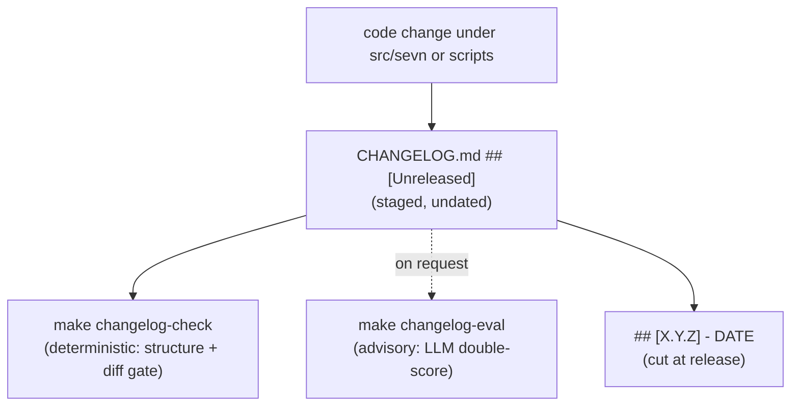

# Changelog standards (spec-kit-wave)

The user-facing history for sevn.bot lives in `CHANGELOG.md` at the repo root. This kit owns
the **template**, **authoring rules**, and the **quality bar** (deterministic row rules plus an
advisory LLM double-score). Enforcement plumbing — the deterministic validator, the
`changelog-rules.toml` rule file, and the `make` targets — is owned separately; this doc teaches
authors how to write entries that pass it.

## What we borrowed

| Source | What we took | Where it lives |
| --- | --- | --- |
| [Keep a Changelog 1.1.0](https://keepachangelog.com/en/1.1.0/) | Six ordered categories, `## [Unreleased]` staging block, human-first prose | `changelog-templates/changelog-template.md`; §Categories |
| [Semantic Versioning 2.0.0](https://semver.org/spec/v2.0.0.html) | Version headings `## [X.Y.Z] - DATE`; category → bump mapping | §Cutting a release |
| [inancgumus/skills/git-pr](https://github.com/inancgumus/skills/tree/main/git-pr) | Impact-first voice: describe the outcome for the reader, not the mechanism | §Voice; `skills/changelog-author` |
| [pydantic-evals](https://ai.pydantic.dev/evals/) `LLMJudge` | Rubric-scored LLM judging; structured per-dimension scores | §LLM double-score; `src/skw/changelog_eval.py` |
| about-sevn.bot golden_llm eval | Structured judge model + on-request (never-in-CI) live eval discipline | `src/skw/changelog_eval.py` |

### Keep a Changelog — fit for sevn

**Use:** the six categories, the Unreleased staging block, human-readable bullets, newest-first
ordering, and cutting versions from Unreleased on release.

**Do not adopt wholesale:** linking every entry to a compare URL, or one file per version — sevn
keeps a single `CHANGELOG.md` and lets the deterministic gate handle structure.

## Document layers



Two independent gates guard the changelog. The **deterministic** gate (`make changelog-check`)
is mandatory and runs in CI: it enforces structure, row syntax, and that code diffs carry an
Unreleased entry. The **LLM double-score** (`make changelog-eval`) is advisory, runs only on
request with live model access, and **never** runs in CI.

## The two gates

| Gate | Command | When | Blocking? |
| --- | --- | --- | --- |
| Deterministic structure + diff | `make changelog-check` | Every PR touching `src/sevn` or `scripts` | Yes (CI) |
| LLM double-score (quality) | `make changelog-eval` | On request, before finalising entries | No (advisory) |

## Categories

Exactly six, in Keep a Changelog order. Empty subheadings under `## [Unreleased]` are allowed.

| Category | Use when… | SemVer signal |
| --- | --- | --- |
| **Added** | A new capability, command, flag, endpoint, or config key now exists | MINOR |
| **Changed** | Existing behaviour, defaults, or output changed in a way a user notices | MINOR (or MAJOR if breaking) |
| **Deprecated** | Something still works but is on notice for removal | MINOR |
| **Removed** | A capability, flag, or config key is gone | MAJOR |
| **Fixed** | A bug no longer happens | PATCH |
| **Security** | A vulnerability was addressed or hardening landed | PATCH (or higher) |

Pick the single best category. A breaking change goes under **Changed** or **Removed** and is
called out as breaking in the entry text.

## Entry-row rules (deterministic gate)

The deterministic validator enforces these; write to them so authored entries pass on the first
try. Applies to bullets under `## [Unreleased]` only — released, dated sections keep their
history verbatim.

1. **Leading datestamp** — start the body (after `- `) with `[YYYY-MM-DD]` (date-only default).
   An optional time suffix `[YYYY-MM-DDTHH:MMZ]` is allowed. Leading placement avoids collision
   with `(#123)` refs and the no-trailing-period rule. (Enforced via `require_datestamp` /
   `datestamp_pattern` in `changelog-rules.toml`; released `## [X.Y.Z] - DATE` bullets do **not**
   require a per-row stamp.)
2. **Bullet syntax:** each entry is a markdown bullet starting with `- ` under a `### Category`
   heading.
3. **Sentence case:** uppercase the first letter of the prose **after** the datestamp; do not
   Title-Case the whole line (unless the prose opens with a `` `code` `` span).
4. **No trailing period.** End on the last word (or a closing backtick / `)`), not `.` — a
   trailing `...` ellipsis is allowed.
5. **Minimum body:** at least 12 characters of real content in the full bullet (stamp + prose) —
   no `- wip` or `- fix`.
6. **Issue / PR refs:** cite as `(#123)` at the end of the line. Plain `#123`, no backticks on
   the ref itself, so it auto-links on GitHub.
7. **Backticks:** use them for code, commands, flags, and paths (`sevn onboard`, `--retry`,
   `src/sevn/gateway/`). Do not backtick ordinary prose.
8. **One change per bullet.** Split unrelated changes into separate rows.

**Passing examples:**

```markdown
### Added
- [2026-07-14] New `--retry` flag on `sevn onboard` to resume an interrupted setup (#412)

### Fixed
- [2026-07-14] Crash when a workspace path contained a trailing space
```

**Failing examples (and why):**

```markdown
- New feature without a datestamp     # missing the leading [YYYY-MM-DD] stamp
- [2026-07-14] Fixed stuff.           # trailing period; too vague; < 12 chars of content
- [2026-07-14] Added A New Retry Flag # Title Case; "Added" restates the category
- see #412                            # not a change; lowercase; bare ref without (#…)
```

## The "code change ⇒ Unreleased entry" policy

Any PR that touches user-visible surface under `src/sevn/` or `scripts/` **must** add at least
one bullet under `## [Unreleased]`. The deterministic diff gate fires when such a diff carries no
new Unreleased row.

### Escape hatch

For diffs with genuinely no user-visible effect (internal refactor, test-only change, comment
fix), opt out explicitly. Add the trailer

```
changelog: skip
```

to the PR description (or the commit body, per the enforcement config). Use it sparingly — if a
reviewer would ask "what changed for users?", write an entry instead.

## Cutting a release

Versions are cut **from** the Unreleased block; never hand-write dated entries directly.

1. Choose the version from the highest SemVer signal present in Unreleased (Removed/breaking →
   MAJOR, Added/Changed → MINOR, Fixed/Security only → PATCH).
2. Rename `## [Unreleased]` content into a new `## [X.Y.Z] - YYYY-MM-DD` section (ISO date),
   dropping any empty category subheadings from the cut section.
3. Add a fresh, empty `## [Unreleased]` block with all six subheadings at the top.
4. The newest version sits directly under Unreleased; older versions follow, newest-first.

## LLM double-score (quality bar)

The deterministic gate proves an entry is *well-formed*; the LLM double-score judges whether it is
*good*. It is advisory, on-request, and needs live model access — run it while drafting, not in
CI. Thresholds and rubric come from `changelog-rules.toml` `[eval]`, with the defaults below.

### Structured score (per dimension)

One judge pass scores every rubric dimension on an integer **0–10** scale with a one-line
rationale. **Pass when every dimension `>= structured_min` (default 7).**

| Dimension | The judge asks… |
| --- | --- |
| `specificity` | Does the entry name the concrete surface that changed, not "various fixes"? |
| `user_impact_clarity` | Would a reader who did not write the code know what is different for them? |
| `category_correctness` | Is it under the right Keep a Changelog category? |
| `diff_equivalence` | Does it faithfully match the actual diff — nothing invented, nothing material omitted? |

### Unstructured score (holistic)

A second, separate judge pass with **no rubric scaffolding**: one overall **0–10** plus free
prose. **Pass when `>= unstructured_min` (default 7).**

### Verdict

**PASS only when both the structured pass (every dimension) and the unstructured pass clear their
thresholds.** The report shows both scores with rationales so authors know exactly what to revise.

| Setting | Default | Source |
| --- | --- | --- |
| `structured_min` | 7 | `changelog-rules.toml` `[eval]` |
| `unstructured_min` | 7 | `changelog-rules.toml` `[eval]` |
| `rubric_dimensions` | `specificity`, `user_impact_clarity`, `category_correctness`, `diff_equivalence` | `changelog-rules.toml` `[eval]` |
| Default judge model | `anthropic:claude-haiku-4-5-20251001` (cheap) | module default / `--model` / `SEVN_CHANGELOG_JUDGE_MODEL` |

When no model or API key is configured, the eval **fails loudly** (non-zero exit with a clear
message) rather than silently passing.

## Voice

Absorb the git-pr philosophy: describe the **outcome for the user**, then the trigger if it helps.

- Impact first, mechanism second. Bad: "Refactor session mutex handling." Good: "Session toggles
  now persist across restarts."
- No internal component names, function names, or lock/goroutine jargon in the prose.
- Active voice, plain terms a PM could read. Backticks only for real code, commands, flags, paths.
- One change per bullet; scale detail to the change.

## Commands

```bash
# Deterministic gate (structure + row rules + diff → Unreleased); runs in CI
make changelog-check

# Advisory LLM double-score (needs a judge model; never in CI)
make changelog-eval
make changelog-eval MODEL=anthropic:claude-sonnet-5   # override the judge

# Direct module invocation (from src/tripll/skw/)
uv run python -m skw.changelog_eval --repo .. --base origin/main --json
```

## Files

| File | Purpose |
| --- | --- |
| `CHANGELOG-STANDARDS.md` | This normative standard |
| `changelog-templates/changelog-template.md` | Full CHANGELOG.md skeleton |
| `changelog-templates/entry-template.md` | Annotated good/bad single-entry examples per category |
| `skills/changelog-author/SKILL.md` | Creation skill — draft/refresh Unreleased entries from a diff |
| `skills/changelog-review/SKILL.md` | Evaluation skill — run both gates and interpret the scores |
| `agents/changelog-author.md` | Agent reference for authoring |
| `agents/changelog-reviewer.md` | Agent reference for gating + double-score |
| `src/skw/changelog_eval.py` | LLM double-score implementation (pydantic-ai + pydantic-evals) |
| `changelog-rules.toml` | Machine-readable rules + `[eval]` thresholds (owned by enforcement) |
